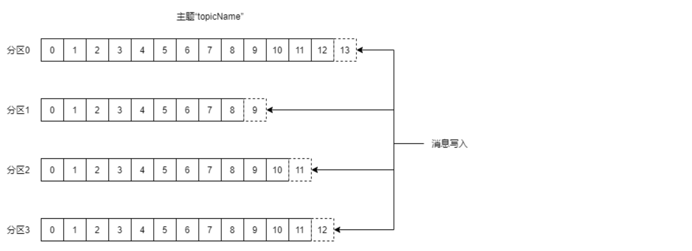
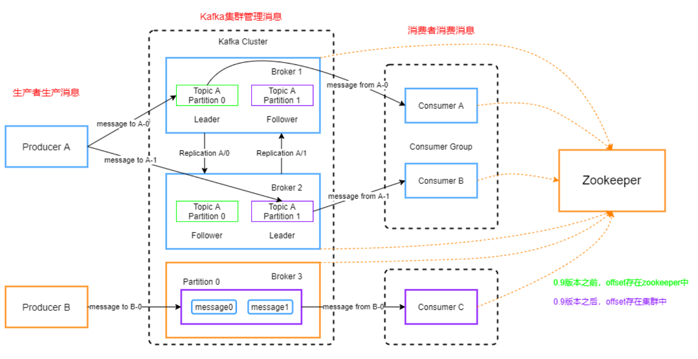

# Apache Kafka 源码分析第一次报告

apache kafka 主要包含数据主题和分区机制以及消息传递两个模块，本次报告分析选择数据主题和分区机制模块

### 数据主题和分区机制基本介绍

Kafka的消息通过主题（Topic）进行分类，主题可以被分为若干个分区（Partition），一个分区就是一个提交日志。消息以追加的方式写入分区，然后以先进先出的顺序读取（注意到由于将主题分为多个分区，因此每次消息写入时只会保证在分区中的顺序，在主题中的顺序无法保证）

Kafka 集群保留所有发布的记录（无论他们是否已被消费），并通过保留期限来控制

对于每一个分区而言都会有很多的副本；在这些副本之中，会存在leader与follower。分区的不同副本会保存在不同的代理节点（broker）上。通过这种分区机制，能够保证主题的每一个分区的数据不易丢失。同时当消费者与生产者发送数据时，总是发送到对应分区的leader的broker上，并最终同步到该分区的其他follower

### 生产者对于主题分区的操作

* 生产者每次将自己的消息集通过key值（如果有）获得对应的分区（如果没有则对分区数量取模），同时在客户端判断出所写分区的主副本所在节点，将同一个节点的分区消息一起发送。而在服务端，有ack应答机制，Kafka提供了三种可靠性级别。有些数据有必要等ISR中的follower全部接收成功，有些不用同步成功。

### 消费者对于主题分区的操作

* 消费者往往是由一个消费组及在内的消费者组成。
* 消费者采用pull（拉）的模式从broker中读取数据，并且只可以从主副本中获得数据
* pull模式的不足之处是，如果kafka没有数据，消费者可能会陷入循环中，一直返回空数据。针对这一点，kafka的消费者在消费数据时会传入一个时长参数timeout，如果当前没有数据可消费，消费者会等待一段时间后再返回。
* 消费者在对一个Topic提出获取消息需求时，对于每一个Topic，首先对分区按照分区ID进行排序，然后订阅这个Topic的消费组的消费者再进行排序，之后尽量均衡的将分区分配给消费者。

### 关于对消息主题采用分区的理由

1. 多Partition分布式存储，利于集群数据的均衡。
2. 并发读写，加快读写速度。
3. 加快数据恢复的速率：当某台机器崩溃，每个Topic仅需恢复一部分的数据，多机器并发。

* 对于分区的原则而言，如果有key值则可以按照key值进行分区的划分，如果没有则通过生成随机数后对分区数取模的方式进行分区划分

### apache kafka的可靠性保证

Kafka的复制机制和分区的多副本架构是kafka可靠性保证的核心。把消息写入多个副本可以使kafka在崩溃时仍能保证消息的持久性

* kafka可以保证分区消息的顺序。如果使用同一个生产者往同一个分区写入消息，而且消息B在消息A之后写入，那么kafka可以保证消息B的偏移量比消息A的偏移量大，在每个分区内做到被整写入的顺序，从而使得消费者会先读取到消息A再读取消息B。
* kafka可以保证分区消息写入时多副本接收，并保证该消息一定被写入。只有当消息被写入分区的所有副本时，它才被认为是“已提交”的。生产者可以通过kafka提供的可靠性级别来决定ack应道满足的条件
* kafka可以保证分区信息不会丢失。只要还有一个副本是活跃的，那么已经提交的信息就不会丢失。且只有当消息已经确认提交，消费者才能接收到
