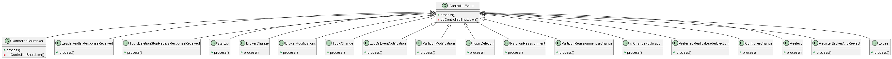

## Kafka_Controller中的观察者模式

kafka控制器中的观察者模式，主要体现在kafka通过在ZK节点上注册监听器，来监听发生的事件，并将其加入到事件处理队列中由controllerEventManager类来进行处理。在注册完监听器以后，有许多类会继承监听器的类，重写监听器的handleChildChange()方法。但同时需要注意的是，在kafka控制器中，只有具体的观察者和抽象的观察者，因为被观察者并不位于kafka控制器模块中，因此在此不做讨论。

### 观察者模式

观察者模式定义了一种一对多的依赖关系，让多个观察者对象同时监听某一个主题对象。这个主题对象在状态上发生变化时，会通知所有观察者对象，使它们能够自动更新自己。使用观察者模式可以使目标和观察者之间的耦合是抽象的和最小的，并支持广播通信。

### ZNodeChildChangeHandler类与ZNodeChangeHandler类

```java
trait ZNodeChangeHandler {
  val path: String
  def handleCreation(): Unit = {}
  def handleDeletion(): Unit = {}
  def handleDataChange(): Unit = {}
}

trait ZNodeChildChangeHandler {
  val path: String
  def handleChildChange(): Unit = {}
}
```

以上两个类均位于kafka\core\src\main\scala\kafka\zookeeper\ZooKeeperClient.scala文件中

ZNodeChildChangeHandler类与ZNodeChangeHandler类作为观察者的抽象类，也是zk节点中需要被注册的监听器。它们负责监听controllerEvent事件，并且有子类继承handleChange()方法来对这些事件进行处理，加入到controllerEvent队列中

类图如下：


关于具体观察者的一些类：

```java


class BrokerModificationsHandler(controller: KafkaController, eventManager: ControllerEventManager, brokerId: Int) extends ZNodeChangeHandler {
  override val path: String = BrokerIdZNode.path(brokerId)

  override def handleDataChange(): Unit = {
    eventManager.put(controller.BrokerModifications(brokerId))
  }
}

class TopicChangeHandler(controller: KafkaController, eventManager: ControllerEventManager) extends ZNodeChildChangeHandler {
  override val path: String = TopicsZNode.path

  override def handleChildChange(): Unit = eventManager.put(controller.TopicChange)
}

class LogDirEventNotificationHandler(controller: KafkaController, eventManager: ControllerEventManager) extends ZNodeChildChangeHandler {
  override val path: String = LogDirEventNotificationZNode.path

  override def handleChildChange(): Unit = eventManager.put(controller.LogDirEventNotification)
}

```

以上几个类均位于kafka\core\src\main\scala\kafka\controller\KafkaController.scala文件中。

由于继承监听器的类众多，均为具体观察者，因此在这里不将所有的具体观察者类全部展出。这些具体观察者均继承了ZNodeChildChangeHandler类或ZNodeChangeHandler类，并改写了方法，方便再监听到之间的时候进行调用

下面的一些函数是关于如何在zk节点中注册监听器与取消注册监听器的函数

```
/**
   * See ZooKeeperClient.registerZNodeChildChangeHandler
   * @param zNodeChildChangeHandler
   */
  def registerZNodeChildChangeHandler(zNodeChildChangeHandler: ZNodeChildChangeHandler): Unit = {
    zooKeeperClient.registerZNodeChildChangeHandler(zNodeChildChangeHandler)
  }

  /**
   * See ZooKeeperClient.unregisterZNodeChildChangeHandler
   * @param path
   */
  def unregisterZNodeChildChangeHandler(path: String): Unit = {
    zooKeeperClient.unregisterZNodeChildChangeHandler(path)
  }
```

以上两个函数均位于kafka\core\src\main\scala\kafka\zk\KafkaZkClient.scala文件中。

以上两个函数通过对zooKeeperClient中的函数的调用，实现了监听器的注册和注销


## Kafka_Controller中的消费者模式

kafka控制器中的观察者模式，主要体现在kafka控制器的工作机理在于根据监听器，将所有客户端的请求转化为controllerEvent事件，并将其加入到消费者队列中。kafka控制器中有一个子类controllerEventManager，专门用于处理controllerEvent队列中的controllerEvent请求。kafka控制器通过阻塞队列，时的生产者得以和消费者controllerEventManager解耦，得以大幅度提高事件处理的效率

#### 生产者/消费者模式

某个模块负责产生数据，这些数据由另一个模块来负责处理（此处的模块是广义的，可以是类、函数、线程、进程等）。产生数据的模块，就形象地称为生产者；而处理数据的模块，就称为消费者。在生产者与消费者之间在加个缓冲区，我们形象的称之为仓库，生产者负责往仓库了进商品，而消费者负责从仓库里拿商品，这就构成了生产者消费者模式。

#### ControllerEvent类

```java
sealed trait ControllerEvent {
  def state: ControllerState
  def process(): Unit
}
```

以上类位于kafka\core\src\main\scala\kafka\controller\KafkaController.scala文件中。

ControllerEvent类是一个抽象类，它定义了所有客户端的请求最终处理的格式。每次监听器被触发，他都会被压入到事件队列中，具体代码见上观察者模式中的各种handler

关于继承ControllerEvent的一些具体类

```java
case object IsrChangeNotification extends ControllerEvent {
    override def state: ControllerState = ControllerState.IsrChange

    override def process(): Unit = {
      if (!isActive) return
      val sequenceNumbers = zkClient.getAllIsrChangeNotifications
      try {
        val partitions = zkClient.getPartitionsFromIsrChangeNotifications(sequenceNumbers)
        if (partitions.nonEmpty) {
          updateLeaderAndIsrCache(partitions)
          processUpdateNotifications(partitions)
        }
      } finally {
        // delete the notifications
        zkClient.deleteIsrChangeNotifications(sequenceNumbers)
      }
    }

    private def processUpdateNotifications(partitions: Seq[TopicPartition]) {
      val liveBrokers: Seq[Int] = controllerContext.liveOrShuttingDownBrokerIds.toSeq
      debug(s"Sending MetadataRequest to Brokers: $liveBrokers for TopicPartitions: $partitions")
      sendUpdateMetadataRequest(liveBrokers, partitions.toSet)
    }
  }
```

其他具体类不在此赘述。这些具体类都会改写process方法，以便在被controllerEventManager调用时可以被运用process()方法来进行处理(process()方法中所使用的函数均为kafkaController类中的函数)

类图如下：



#### ControllerEventManager类

```java
class ControllerEventManager(controllerId: Int, rateAndTimeMetrics: Map[ControllerState, KafkaTimer],
                             eventProcessedListener: ControllerEvent => Unit) {

  @volatile private var _state: ControllerState = ControllerState.Idle
  private val putLock = new ReentrantLock()
  private val queue = new LinkedBlockingQueue[ControllerEvent]
  private val thread = new ControllerEventThread(ControllerEventManager.ControllerEventThreadName)

  def state: ControllerState = _state

  def start(): Unit = thread.start()

  def close(): Unit = {
    clearAndPut(KafkaController.ShutdownEventThread)
    thread.awaitShutdown()
  }

  def put(event: ControllerEvent): Unit = inLock(putLock) {
    queue.put(event)
  }

  def clearAndPut(event: ControllerEvent): Unit = inLock(putLock) {
    queue.clear()
    queue.put(event)
  }

  class ControllerEventThread(name: String) extends ShutdownableThread(name = name, isInterruptible = false) {
    logIdent = s"[ControllerEventThread controllerId=$controllerId] "

    override def doWork(): Unit = {
      queue.take() match {
        case KafkaController.ShutdownEventThread => initiateShutdown()
        case controllerEvent =>
          _state = controllerEvent.state

          try {
            rateAndTimeMetrics(state).time {
              controllerEvent.process()
            }
          } catch {
            case e: Throwable => error(s"Error processing event $controllerEvent", e)
          }

          try eventProcessedListener(controllerEvent)
          catch {
            case e: Throwable => error(s"Error while invoking listener for processed event $controllerEvent", e)
          }

          _state = ControllerState.Idle
      }
    }
  }

}
```

以上类位于kafka\core\src\main\scala\kafka\controller\ControllerEventManager.scala文件中。

controllerEventManager类负责对事件队列中的事件进行处理，它包括生产者/消费者模式中的一些基本操作，比如run(),clear(),put()操作。

put()：调用该函数，将事件加入到消费者阻塞队列中

clearAndPut()：调用该函数，清空队列并将事件加入到消费者阻塞队列中

doWork()：相当于生产者中的run()方法。它会尝试去调用消费者阻塞队列中的controllerEvent中的process()方法来对该事件进行处理，如果出错则会报出"处理controllerEvent异常"错误


## Kafka_Controller中的策略模式

kafka控制器中的策略模式，主要体现在kafka的controllerEvent中，会有process()方法。process方法会被继承其的子类继承，因此每次父类在调用process()方法时，都会直接用到子类的process()方法。在这种情况下，具有良好的可扩展性，以后若需要新增需求，可以随意添加子类继承controllerEvent类，改写父类的process()方法，即可在controllerEventManager处理事件时调用该方法

#### 策略模式

策略模式是一种行为型模式，它将对象和行为分开，将行为定义为一个行为接口和具体行为的实现。策略模式最大的特点是行为的变化，行为之间可以相互替换。每个if判断都可以理解为就是一个策略。本模式使得算法可独立于使用它的用户而变化

#### ControllerEvent类与继承其的子类的比较

```java
sealed trait ControllerEvent {
  def state: ControllerState
  def process(): Unit
}

case object PartitionReassignment extends ControllerEvent {
    override def state: ControllerState = ControllerState.PartitionReassignment

    override def process(): Unit = {
      if (!isActive) return

      // We need to register the watcher if the path doesn't exist in order to detect future reassignments and we get
      // the `path exists` check for free
      if (zkClient.registerZNodeChangeHandlerAndCheckExistence(partitionReassignmentHandler)) {
        val partitionReassignment = zkClient.getPartitionReassignment

        // Populate `partitionsBeingReassigned` with all partitions being reassigned before invoking
        // `maybeTriggerPartitionReassignment` (see method documentation for the reason)
        partitionReassignment.foreach { case (tp, newReplicas) =>
          val reassignIsrChangeHandler = new PartitionReassignmentIsrChangeHandler(KafkaController.this, eventManager,
            tp)
          controllerContext.partitionsBeingReassigned.put(tp, ReassignedPartitionsContext(newReplicas, reassignIsrChangeHandler))
        }

        maybeTriggerPartitionReassignment(partitionReassignment.keySet)
      }
    }
  }

  case class PartitionReassignmentIsrChange(partition: TopicPartition) extends ControllerEvent {
    override def state: ControllerState = ControllerState.PartitionReassignment

    override def process(): Unit = {
      if (!isActive) return
      // check if this partition is still being reassigned or not
      controllerContext.partitionsBeingReassigned.get(partition).foreach { reassignedPartitionContext =>
        val reassignedReplicas = reassignedPartitionContext.newReplicas.toSet
        zkClient.getTopicPartitionStates(Seq(partition)).get(partition) match {
          case Some(leaderIsrAndControllerEpoch) => // check if new replicas have joined ISR
            val leaderAndIsr = leaderIsrAndControllerEpoch.leaderAndIsr
            val caughtUpReplicas = reassignedReplicas & leaderAndIsr.isr.toSet
            if (caughtUpReplicas == reassignedReplicas) {
              // resume the partition reassignment process
              info(s"${caughtUpReplicas.size}/${reassignedReplicas.size} replicas have caught up with the leader for " +
                s"partition $partition being reassigned. Resuming partition reassignment")
              onPartitionReassignment(partition, reassignedPartitionContext)
            }
            else {
              info(s"${caughtUpReplicas.size}/${reassignedReplicas.size} replicas have caught up with the leader for " +
                s"partition $partition being reassigned. Replica(s) " +
                s"${(reassignedReplicas -- leaderAndIsr.isr.toSet).mkString(",")} still need to catch up")
            }
          case None => error(s"Error handling reassignment of partition $partition to replicas " +
                         s"${reassignedReplicas.mkString(",")} as it was never created")
        }
      }
    }
  }
```

以上类位于kafka\core\src\main\scala\kafka\controller\KafkaController.scala文件中。

由此可以很明确的看出，每个子类都复写了process方法来供调用，因此在此采用了策略模式
