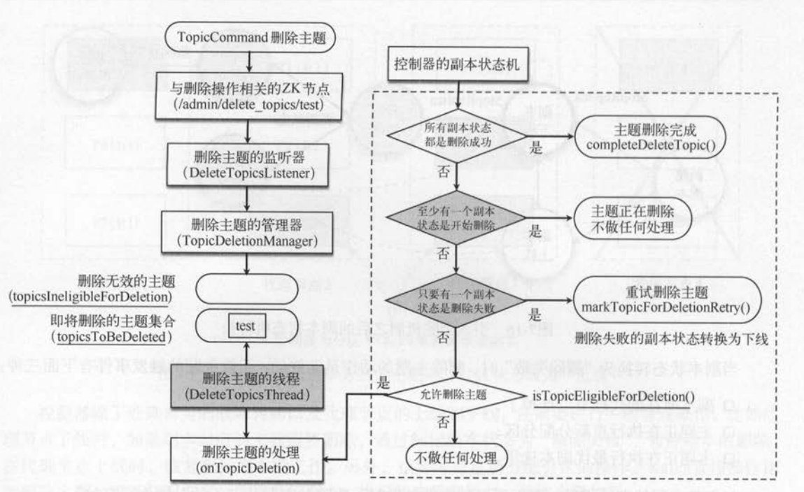

# topicDeletionManager

topicDeletionManager是controller模块中负责进行主题删除的类，主要函数在于resumeDeletion。topicDeletionManager通过resumeDeletion()函数实现主题删除，并且在当前由于各种原因主题删除不成功时，能够回滚事务，通过检查副本的状态再次进行主题删除。topicDeletionManager中的其它函数通过调用resumeDeletion()函数来实现他们的操作。下面通过对主要函数来分析topicDeletionManager类的功能

topicDeletionManager大体流程

#### resumeDeletions()

```java
private def resumeDeletions(): Unit = {
    val topicsQueuedForDeletion = Set.empty[String] ++ topicsToBeDeleted

    if (topicsQueuedForDeletion.nonEmpty)
      info(s"Handling deletion for topics ${topicsQueuedForDeletion.mkString(",")}")

    topicsQueuedForDeletion.foreach { topic =>
      // if all replicas are marked as deleted successfully, then topic deletion is done
      if (controller.replicaStateMachine.areAllReplicasForTopicDeleted(topic)) {
        // clear up all state for this topic from controller cache and zookeeper
        completeDeleteTopic(topic)
        info(s"Deletion of topic $topic successfully completed")
      } else {
        if (controller.replicaStateMachine.isAtLeastOneReplicaInDeletionStartedState(topic)) {
          // ignore since topic deletion is in progress
          val replicasInDeletionStartedState = controller.replicaStateMachine.replicasInState(topic, ReplicaDeletionStarted)
          val replicaIds = replicasInDeletionStartedState.map(_.replica)
          val partitions = replicasInDeletionStartedState.map(_.topicPartition)
          info(s"Deletion for replicas ${replicaIds.mkString(",")} for partition ${partitions.mkString(",")} of topic $topic in progress")
        } else {
          // if you come here, then no replica is in TopicDeletionStarted and all replicas are not in
          // TopicDeletionSuccessful. That means, that either given topic haven't initiated deletion
          // or there is at least one failed replica (which means topic deletion should be retried).
          if (controller.replicaStateMachine.isAnyReplicaInState(topic, ReplicaDeletionIneligible)) {
            // mark topic for deletion retry
            markTopicForDeletionRetry(topic)
          }
        }
      }
      // Try delete topic if it is eligible for deletion.
      if (isTopicEligibleForDeletion(topic)) {
        info(s"Deletion of topic $topic (re)started")
        // topic deletion will be kicked off
        onTopicDeletion(Set(topic))
      } else if (isTopicIneligibleForDeletion(topic)) {
        info(s"Not retrying deletion of topic $topic at this time since it is marked ineligible for deletion")
      }
    }
  }
```

resumeDeletions()函数的主要功能

1. 每次进入该函数之前首先进行判断，根据controller.replicaStateMachine.areAllReplicasForTopicDeleted(topic)来得出对于当前主题的所有副本是否已经完成删除；若已完成则调用completeDeleteTopic(topic)函数，将该主题的副本状态机，分区状态机转为NonExistentReplica与NonExistentPartition，并将topicToBeDeleted减去删除的主题数，移除zk节点上该主题存在过的一切痕迹，包括缓存(中间需要判断当前是否有一个副本正在删除，如果有说明当前主题正在删除中，不做任何处理)
2. 若上述条件判断不成立，则调用markTopicForDeletionRetry(topic)函数对该主题标记上需删除的标记
3. 上述条件判断完成后，对该主题调用isTopicEligibleForDeletion(topic)和isTopicIneligibleForDeletion(topic)函数，通过这两个函数判断当前主题在当前是否可以被删；如果允许则调用ontopicDeletion()函数进行删除

#### onTopicDeletion(topics: Set[String])

```java
private def onTopicDeletion(topics: Set[String]) {
    info(s"Topic deletion callback for ${topics.mkString(",")}")
    // send update metadata so that brokers stop serving data for topics to be deleted
    val partitions = topics.flatMap(controllerContext.partitionsForTopic)
    controller.sendUpdateMetadataRequest(controllerContext.liveOrShuttingDownBrokerIds.toSeq, partitions)
    val partitionReplicaAssignmentByTopic = controllerContext.partitionReplicaAssignment.groupBy(p => p._1.topic)
    topics.foreach { topic =>
      onPartitionDeletion(partitionReplicaAssignmentByTopic(topic).keySet)
    }
  }
```

onTopicDeletion()函数负责进行主题删除。首先向代理节点发送更新元数据的请求，然后调用onPartitionDeletion()函数负责进行分区删除；在onPartitionDeletion()函数中负责对相应的副本状态进行检测，如果发现有副本处于删除失败的状态，则再次进行删除，调用startReplicaDeletion()方法

#### startReplicaDeletion(replicasForTopicsToBeDeleted: Set[PartitionAndReplica])

```java
private def startReplicaDeletion(replicasForTopicsToBeDeleted: Set[PartitionAndReplica]) {
    replicasForTopicsToBeDeleted.groupBy(_.topic).keys.foreach { topic =>
      val aliveReplicasForTopic = controllerContext.allLiveReplicas().filter(p => p.topic == topic)
      val deadReplicasForTopic = replicasForTopicsToBeDeleted -- aliveReplicasForTopic
      val successfullyDeletedReplicas = controller.replicaStateMachine.replicasInState(topic, ReplicaDeletionSuccessful)
      val replicasForDeletionRetry = aliveReplicasForTopic -- successfullyDeletedReplicas
      // move dead replicas directly to failed state
      controller.replicaStateMachine.handleStateChanges(deadReplicasForTopic.toSeq, ReplicaDeletionIneligible)
      // send stop replica to all followers that are not in the OfflineReplica state so they stop sending fetch requests to the leader
      controller.replicaStateMachine.handleStateChanges(replicasForDeletionRetry.toSeq, OfflineReplica)
      debug(s"Deletion started for replicas ${replicasForDeletionRetry.mkString(",")}")
      controller.replicaStateMachine.handleStateChanges(replicasForDeletionRetry.toSeq, ReplicaDeletionStarted,
        new Callbacks(stopReplicaResponseCallback = (stopReplicaResponseObj, replicaId) =>
          eventManager.put(controller.TopicDeletionStopReplicaResponseReceived(stopReplicaResponseObj, replicaId))))
      if (deadReplicasForTopic.nonEmpty) {
        debug(s"Dead Replicas (${deadReplicasForTopic.mkString(",")}) found for topic $topic")
        markTopicIneligibleForDeletion(Set(topic))
      }
    }
  }
```

startReplicaDeletion()步骤

1. 首先将所有的副本分为成功删除副本和需要进行重新删除的副本；注意这个时候是由于之前删除失败重启resumeDeletion()，因此此时的数据全部从controllerContext中获得。将删除失败的副本转到无效集合，然后转到副本下线集合，然后开始删除(这个时候还会将事件压入到eventManager中，并通过Response来接收所传的回调方法)
2. 在完成上述操作后，通过对deadReplicasForTopic是否为空进行检验，如果不为空则仍需要给当前主题打赏当前删除没有成功的标记

tryTopicDeletion()，enqueueTopicsForDeletion(topics: Set[String])，resumeDeletionForTopics(topics: Set[String] = Set.empty)，failReplicaDeletion(replicas: Set[PartitionAndReplica])函数，均是在其中调用了resumeDeletions()函数，因此在此不过多赘述

时序图如下：


