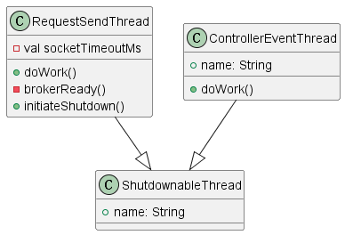

关于其他几个类ControllerEventManager，ControllerContext，StateChangeLogger，ControllerState，由于其本身代码并不复杂，因此在一个文件中阐述他们在kafka控制器中的主要功能。

#### ControllerEventManager

ControllerEventManager中的函数主要为close()，put()，clearAndPut(),以上的几个函数主要是负责对controllerEvent队列进行处理，进行关闭，加入，以及清空之后再加入的动作。controllerEventManager中最重要的类为ControllerEventThread，其中最重要的方法为doWork()方法

```java
override def doWork(): Unit = {
      queue.take() match {
        case KafkaController.ShutdownEventThread => initiateShutdown()
        case controllerEvent =>
          _state = controllerEvent.state

          try {
            rateAndTimeMetrics(state).time {
              controllerEvent.process()
            }
          } catch {
            case e: Throwable => error(s"Error processing event $controllerEvent", e)
          }

          try eventProcessedListener(controllerEvent)
          catch {
            case e: Throwable => error(s"Error while invoking listener for processed event $controllerEvent", e)
          }

          _state = ControllerState.Idle
      }
    }
```

doWork()方法的主要职责在于调用继承controllerEvent类的各种类中的process()方法对队列中的controllerEvent事件进行处理，处理完毕之后触发controllerEvent对应的监听器，并且在此期间在controllerEvent.state和controllerState.Idle之间进行转化。

#### ControllerContext

ControllerContext用于保存controller的上下文，该类中提供了若干set与get函数，如isReplicaOnline()，replicasOnBrokers()方法等。通过这些函数其他类可以保存和获取上下文

#### StateChangeLogger

StateChangeLogger主要用于向log文件中写入各种状态转换的日志文件

#### ControllerState

ControllerState主要用于对状态机中的各种状态进行宏定义

一些与之相关的类图如下：


