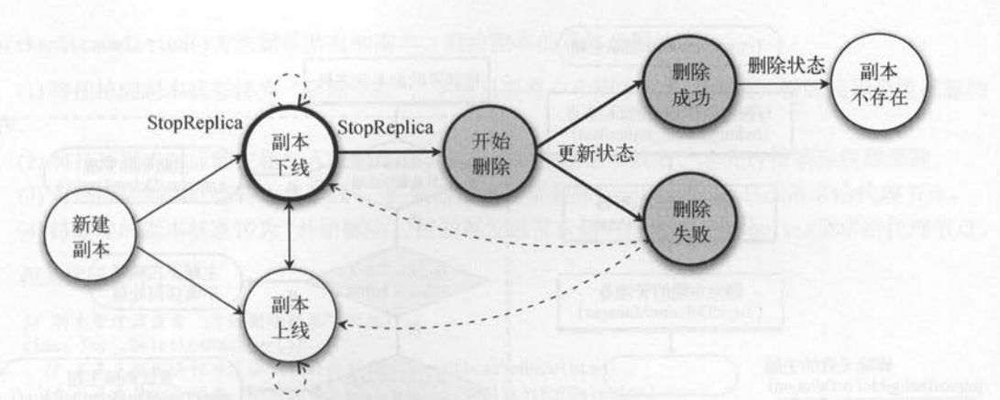

# replicaStateMachine

partitionStateMachine是controller模块中的副本状态机，主要负责副本在NewReplica,OnlineReplica,OfflineReplica,ReplicaDeletionStarted,ReplicaDeletionIneligible,ReplicaDeletionSuccessful,NonExistentReplica其中状态之间的转换。每次进行状态转换时，例如分区将转换为offline状态时，都将会调用removeReplicasFromIsr()函数将其从ISR中移除

副本状态机：



#### doRemoveReplicasFromIsr(replicaId: Int, partitions: Seq[TopicPartition])

```java
private def doRemoveReplicasFromIsr(replicaId: Int, partitions: Seq[TopicPartition]):
  (Map[TopicPartition, LeaderIsrAndControllerEpoch],
    Seq[TopicPartition],
    Map[TopicPartition, Exception]) = {
    val (leaderAndIsrs, partitionsWithNoLeaderAndIsrInZk, failedStateReads) = getTopicPartitionStatesFromZk(partitions)
    val (leaderAndIsrsWithReplica, leaderAndIsrsWithoutReplica) = leaderAndIsrs.partition { case (partition, leaderAndIsr) => leaderAndIsr.isr.contains(replicaId) }
    val adjustedLeaderAndIsrs = leaderAndIsrsWithReplica.mapValues { leaderAndIsr =>
      val newLeader = if (replicaId == leaderAndIsr.leader) LeaderAndIsr.NoLeader else leaderAndIsr.leader
      val adjustedIsr = if (leaderAndIsr.isr.size == 1) leaderAndIsr.isr else leaderAndIsr.isr.filter(_ != replicaId)
      leaderAndIsr.newLeaderAndIsr(newLeader, adjustedIsr)
    }
    val UpdateLeaderAndIsrResult(successfulUpdates, updatesToRetry, failedUpdates) = zkClient.updateLeaderAndIsr(
      adjustedLeaderAndIsrs, controllerContext.epoch)
    val exceptionsForPartitionsWithNoLeaderAndIsrInZk = partitionsWithNoLeaderAndIsrInZk.flatMap { partition =>
      if (!topicDeletionManager.isPartitionToBeDeleted(partition)) {
        val exception = new StateChangeFailedException(s"Failed to change state of replica $replicaId for partition $partition since the leader and isr path in zookeeper is empty")
        Option(partition -> exception)
      } else None
    }.toMap
    val leaderIsrAndControllerEpochs = (leaderAndIsrsWithoutReplica ++ successfulUpdates).map { case (partition, leaderAndIsr) =>
      val leaderIsrAndControllerEpoch = LeaderIsrAndControllerEpoch(leaderAndIsr, controllerContext.epoch)
      controllerContext.partitionLeadershipInfo.put(partition, leaderIsrAndControllerEpoch)
      partition -> leaderIsrAndControllerEpoch
    }
    (leaderIsrAndControllerEpochs, updatesToRetry, failedStateReads ++ exceptionsForPartitionsWithNoLeaderAndIsrInZk ++ failedUpdates)
  }
```

doRemoveReplicasFromIsr()步骤

1. 首先调用getTopicPartitionStatesFromZk(partitions)函数从zk节点获得关于topicPartition的信息
2. 由上得出leaderAndIsrsWithReplica，并且根据此对leader和ISR进行改变，得到adjustedLeaderAndIsrs。调用UpdateLeaderAndIsrResult()函数进行leader和ISR的更新。因为当前副本要转为下线，因此需要将该副本从ISR中移除
3. 调用topicDeletionManager.isPartitionToBeDeleted(partition)判断是否需要对分区进行删除。最红跟新leaderIsrAndControllerEpochs

在replicaStateMachine类中，startup()，handlechanges()，dohandlechanges()函数与分区状态机中的函数基本一致，因此再次不过多赘述。
